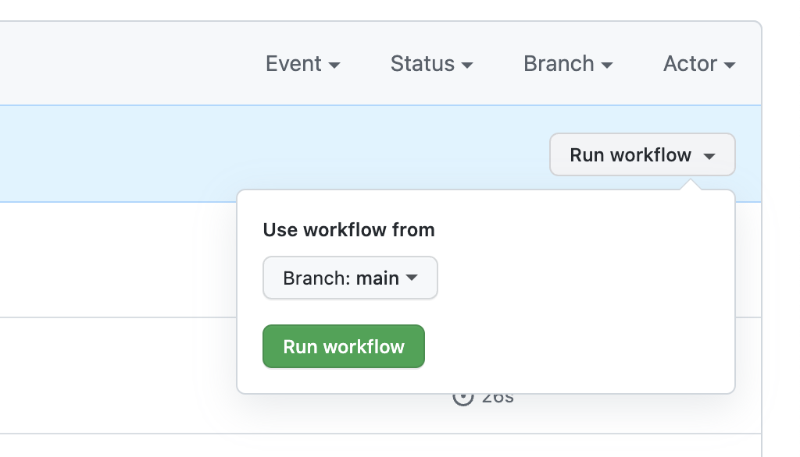

# Oakland NCPC 10Y

## How do I update the content?

You can either run `yarn content` locally, or press the **Run workflow** button on the [Actions](https://github.com/Wattenberger/ncpc-10y/actions/workflows/update-content.yml) page:



## Developing

```bash
yarn # install dependencies
yarn dev # start the dev server
```

## Deploying

The app is automatically built and deployed on Vercel.
